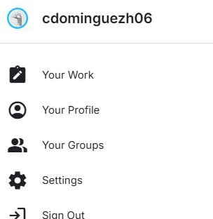
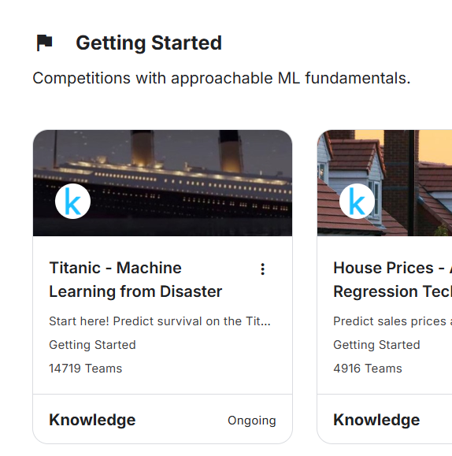
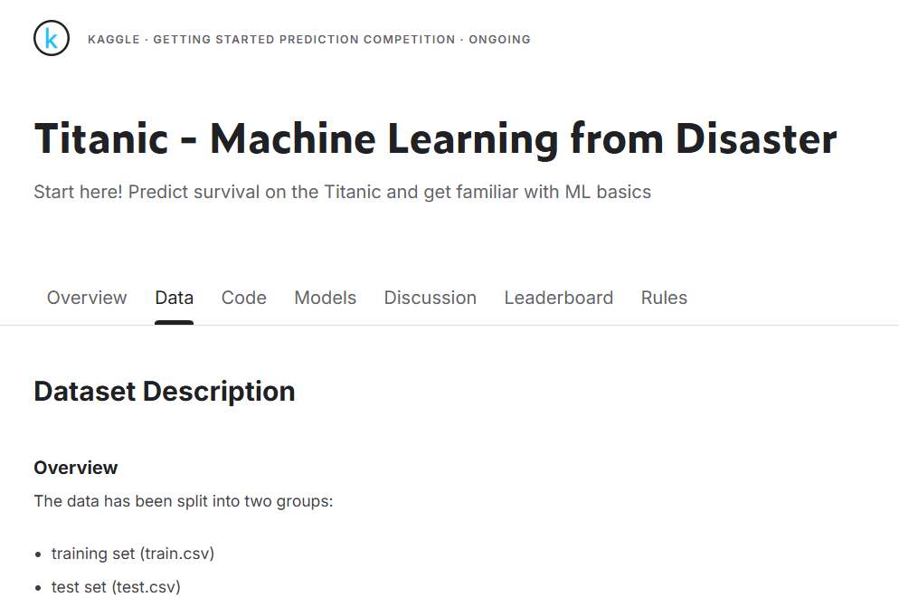
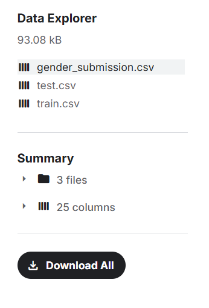

# Pasos para descargar los datos del reto de Kaggle
1. Inicio de sesión en Kaggle (con cuenta de Google)
   

2. Ir al apartado de **Competitions** y buscar un reto

3. Seleccionar el reto deseado y abrir la pestaña de **Data**

4. Hacer *scroll* en la página y pulsar en **Download All**

